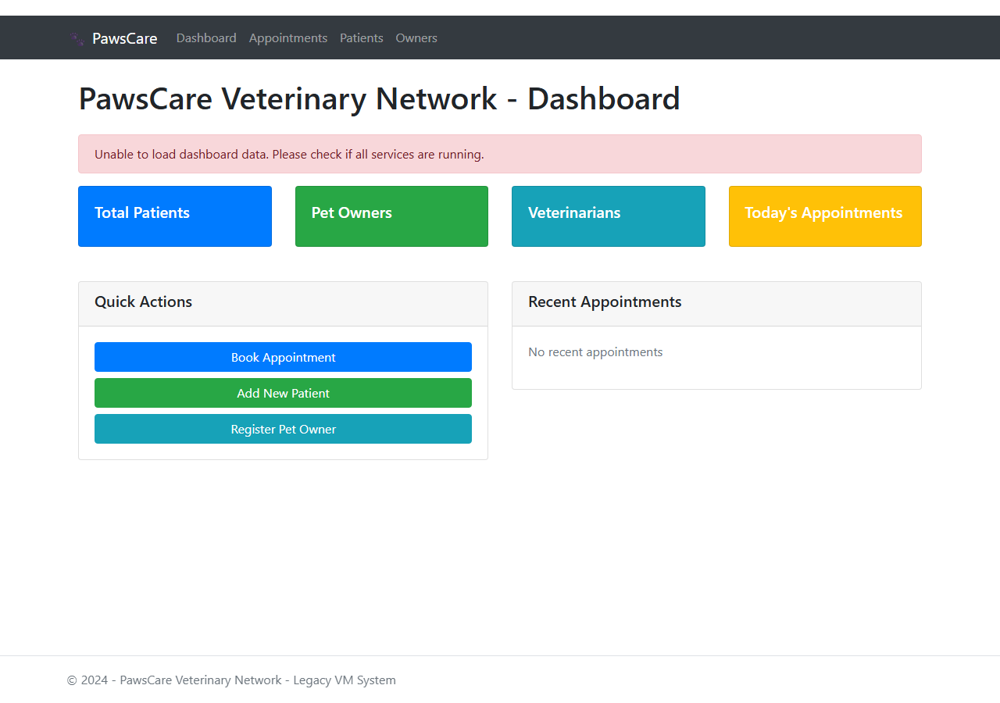
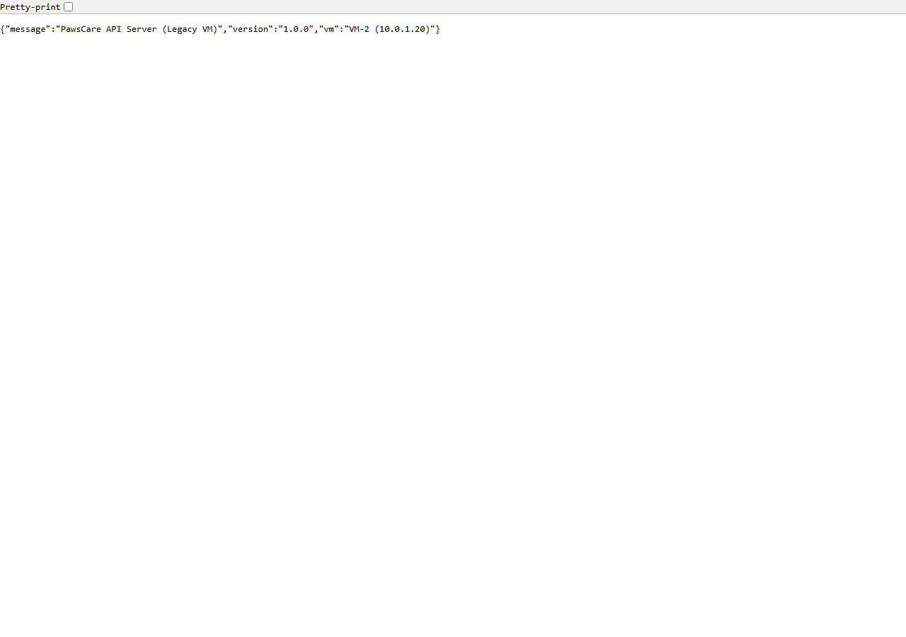
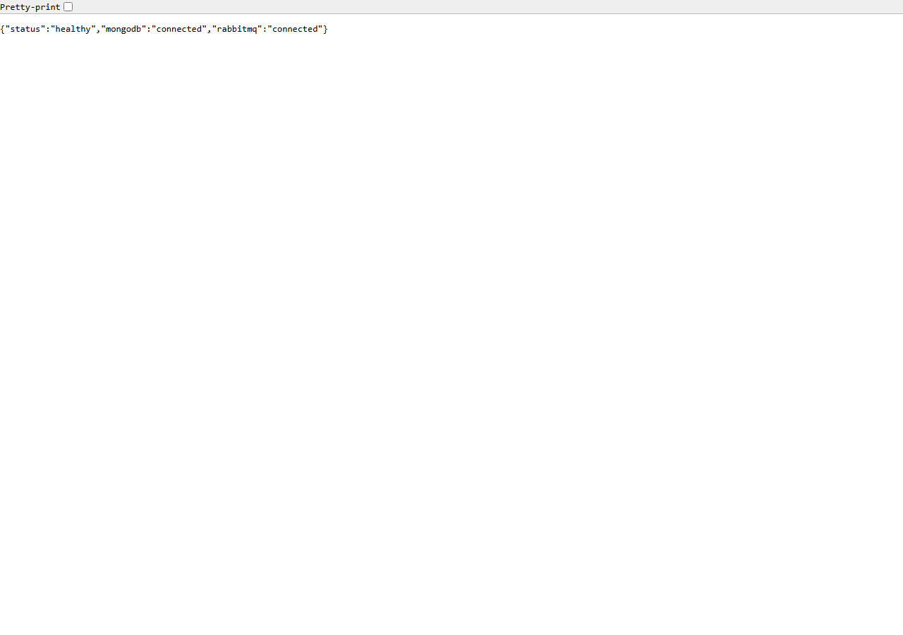
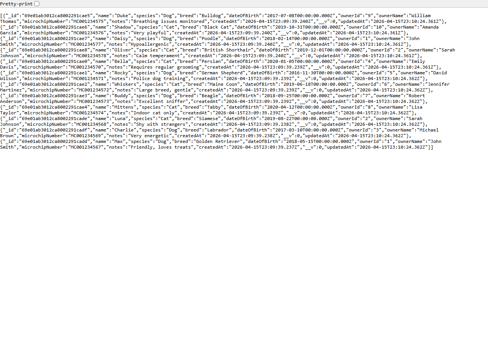
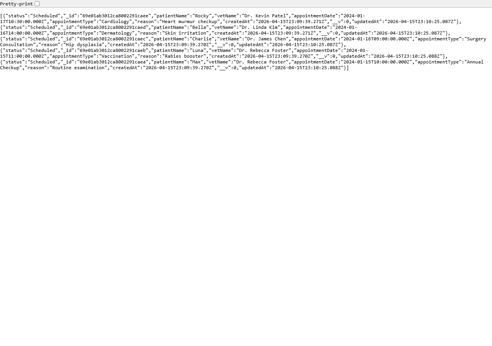
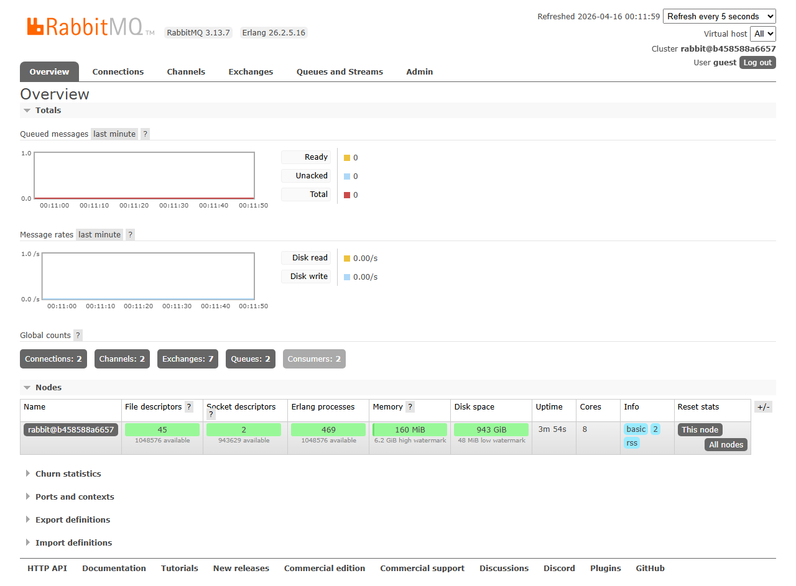
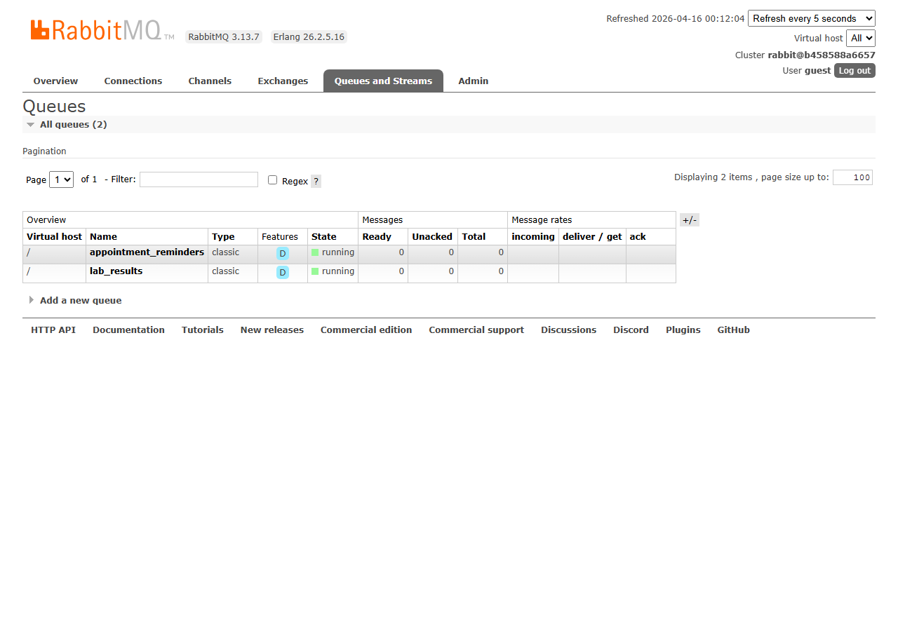
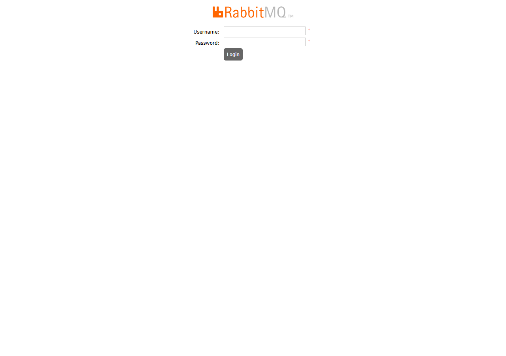

## Overview

This lab guides you through containerizing a three-VM on-premises veterinary network system and deploying it to Azure Container Apps with Dapr, KEDA auto-scaling, and Service Bus integration.

## Understanding the Legacy Architecture

The PawsCare Veterinary Network is a multi-tier legacy system originally running across three on-premises VMs. The following sections show the system running locally via Docker Compose, simulating the original architecture.

### VM 1 — Web Frontend (ASP.NET Core)

The web frontend dashboard shows the PawsCare Veterinary Network UI with navigation for Dashboard, Appointments, Patients, and Owners. Quick action buttons allow booking appointments, adding patients, and registering pet owners.

### VM 2 — API Server (Node.js + Express)

The API server identifies itself as the legacy VM-2 instance running on simulated IP 10.0.1.20:

The health check endpoint confirms MongoDB and RabbitMQ connectivity:

The patients API returns 12 pre-seeded pet records (dogs and cats) with full medical profile data:

The appointments API returns 5 scheduled veterinary appointments across multiple specialists:

### VM 3 — Background Worker Infrastructure (Python + RabbitMQ)

The RabbitMQ management console shows the message broker running with active connections from both the API server and the background worker:

The queues view shows the two durable message queues (`appointment_reminders` and `lab_results`) that the background worker consumes:

The RabbitMQ management login page provides access to the broker administration interface:

## Screenshots Reference

| Screenshot | Description |
|---|---|
|  | VM 1 — ASP.NET Core frontend dashboard |
|  | VM 2 — API server root endpoint |
|  | VM 2 — Health check endpoint |
|  | VM 2 — Patients API response |
|  | VM 2 — Appointments API response |
|  | VM 3 — RabbitMQ management console |
|  | VM 3 — Message queues view |
|  | VM 3 — RabbitMQ login page |
